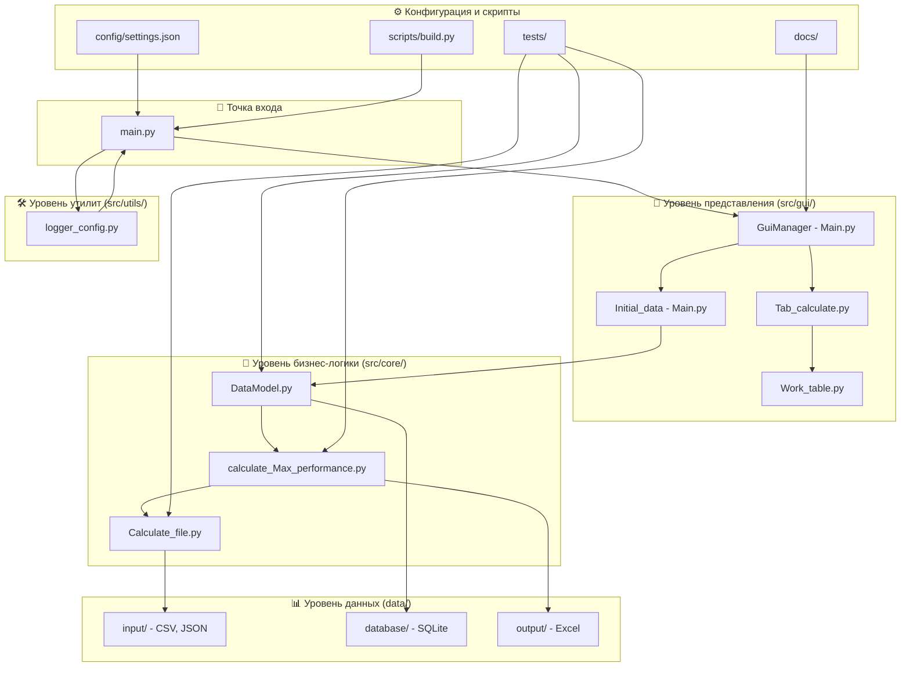

# Калькулятор Максимальной Пропускной Способности ГРС 🏭

[](https://python.org)
[](LICENSE)
[]()

> Комплексное настольное приложение для расчета максимальной пропускной способности газорегуляторных станций (ГРС) с использованием передовых термодинамических моделей и динамики потоков.

## 📋 Содержание
- [Обзор](#-обзор)
- [Основные возможности](#-основные-возможности)
- [Архитектура системы](#-архитектура-системы)
- [Установка](#-установка)
- [Быстрый старт](#-быстрый-старт)
- [Структура проекта](#-структура-проекта)
- [Руководство пользователя](#-руководство-пользователя)
- [Технические детали](#-технические-детали)
- [Участие в разработке](#-участие-в-разработке)
- [Лицензия](#-лицензия)

## 🎯 Обзор

**Калькулятор максимальной пропускной способности ГРС** - это специализированное инженерное приложение, предназначенное для определения оптимальной пропускной способности газорегуляторных станций. Система интегрирует сложные термодинамические расчеты, динамику потоков и анализ производительности оборудования для обеспечения точной оценки пропускной способности в различных рабочих условиях.

### Что делает программа:
- 🔬 **Анализ свойств газа**: Вычисляет плотность, коэффициенты сжимаемости и тепловые свойства
- 🏭 **Производительность оборудования**: Оценивает регуляторы, трубы и тепловые системы
- 📊 **Оптимизация пропускной способности**: Определяет максимальную пропускную способность станции
- 💾 **Управление данными**: Обрабатывает составы газа, диапазоны давлений и параметры оборудования
- 📈 **Визуализация результатов**: Предоставляет комплексные отчеты по расчетам

## ✨ Основные возможности

### 🧪 Продвинутый вычислительный движок
- **Свойства газовых смесей**: Уравнения состояния реального газа с расчетом Z-фактора
- **Динамика потоков**: Уравнения неразрывности для труб и расчеты регуляторов на основе Kv
- **Тепловой анализ**: Расчеты теплового баланса для систем контроля температуры
- **Интеграция производительности**: Комплексный анализ пропускной способности с учетом всех ограничений

### 🖥️ Удобный пользовательский интерфейс
- **Вкладочный рабочий процесс**: Интуитивный пошаговый процесс расчета
- **Формы ввода данных**: Структурированный ввод состава газа и параметров оборудования
- **Результаты в реальном времени**: Мгновенные обновления расчетов и валидация
- **Возможности экспорта**: Сохранение и загрузка сценариев расчетов

### 🔧 Технические возможности
- **Множественные форматы данных**: Поддержка JSON, CSV и базы данных SQLite
- **Система кэширования**: Оптимизированная производительность для повторных расчетов
- **Обработка ошибок**: Комплексная система валидации и логирования
- **Расширяемая архитектура**: Модульный дизайн для легкого добавления функций

## 🏗️ Архитектура системы

Приложение следует архитектурному паттерну **Модель-Представление-Контроллер (MVC)** с современной модульной структурой, организованной по принципам чистой архитектуры:



### 🔧 Основные компоненты новой структуры:

| Слой | Компонент | Файл | Назначение |
|------|-----------|------|------------|
| **🚀 Точка входа** | Main Entry | `main.py` | Инициализация приложения и координация всех компонентов |
| **🖥️ GUI (Представление)** | GuiManager | `src/gui/Main.py` | Управление главным окном и системой событий |
| | Initial_data | `src/gui/Main.py` | Компонент ввода исходных данных |
| | Tab Components | `src/gui/Tab_calculate.py` | Вкладки для различных типов расчетов |
| | Table Widgets | `src/gui/Work_table.py` | Таблицы и фабрики виджетов |
| **🧠 Core (Модель)** | Data Model | `src/core/DataModel.py` | Управление данными, БД, файловые операции |
| | Calculations | `src/core/Calculate_file.py` | Основные математические вычисления |
| | Performance | `src/core/calculate_Max_performance.py` | Оркестратор расчетов производительности |
| **🛠️ Utils (Утилиты)** | Logger | `src/utils/logger_config.py` | Система логирования |
| **📊 Data (Данные)** | Input Data | `data/input/` | CSV файлы составов газа, JSON конфигурации |
| | Database | `data/database/` | SQLite база данных таблиц |
| | Output | `data/output/` | Результаты в Excel формате |
| **🧪 Тестирование** | Unit Tests | `tests/unit/` | Модульные тесты компонентов |
| | Integration Tests | `tests/integration/` | Интеграционные тесты системы |
| **📚 Документация** | Docs | `docs/` | Техническая документация и руководства |
| **⚙️ Конфигурация** | Settings | `config/settings.json` | Настройки приложения |
| | Scripts | `scripts/` | Скрипты автоматизации и сборки |

### 🔄 Потоки данных в новой архитектуре:

1. **Инициализация**: `main.py` → `logger_config` → `GuiManager` → запуск GUI
2. **Ввод данных**: GUI components → `DataModel` → `DataStorage`/`Database`
3. **Расчеты**: `Max_performance` → `Calculate_file` → результаты → GUI
4. **Сохранение**: `DataModel` → `JsonManager`/`CSVManager` → `data/output/`
5. **Логирование**: все компоненты → `logger_config` → `logs/`
6. **Тестирование**: `tests/` → все компоненты → валидация

### 📁 Структурные преимущества:

- ✅ **Четкое разделение ответственности** между слоями
- ✅ **Модульная организация** для легкого тестирования и поддержки
- ✅ **Масштабируемая архитектура** для добавления новых функций
- ✅ **Изолированные зависимости** между компонентами
- ✅ **Стандартная Python структура** для профессиональной разработки
- ✅ **Готовность к упаковке** в Python пакет с setup.py
- ✅ **Комплексная документация** для поддержки разработки

## 🚀 Установка

### Требования
- Python 3.8 или выше
- tkinter (обычно входит в состав Python)
- Необходимые Python пакеты (см. зависимости)

### Зависимости
```bash
pip install pandas numpy matplotlib
```

### Быстрая установка
1. **Клонирование репозитория**:
   ```bash
   git clone <repository-url>
   cd Calculation-of-the-maximum-capacity-of-a-gas-station
   ```

2. **Установка зависимостей**:
   ```bash
   pip install -r requirements.txt  # если доступен
   # или вручную:
   pip install pandas numpy matplotlib
   ```

3. **Запуск приложения**:
   ```bash
   python main.py
   ```

## 🎮 Быстрый старт

### Основной рабочий процесс:

1. **Запуск приложения**
   ```bash
   python main.py
   ```

2. **Настройка исходных данных**
   - Перейдите на вкладку "Исходные данные"
   - Нажмите "Ввести состав газа" для задания состава газа
   - Настройте диапазоны температур и давлений
   - Настройте параметры оборудования в таблицах

3. **Выполнение расчетов**
   - Используйте "Автоматический расчет" для полного анализа
   - Или перейдите по отдельным вкладкам расчетов:
     - **Свойства газа**: Просмотр рассчитанных характеристик газа
     - **Пропускная способность трубы**: Анализ пропускной способности трубопровода
     - **Расчет регулятора**: Оценка производительности регулятора
     - **Тепловой баланс**: Просмотр требований к теплообмену

4. **Просмотр результатов**
   - Проверьте результаты расчетов в каждой вкладке
   - Экспортируйте результаты через меню "Файл"
   - Сохраните конфигурацию проекта для будущего использования

## 📁 Структура проекта

```
Calculation-of-the-maximum-capacity-of-a-gas-station/
├── 📄 main.py                          # 🚀 Главная точка входа в приложение
├── 📄 requirements.txt                 # 📦 Зависимости Python
├── 📄 setup.py                         # ⚙️ Установочный скрипт
├── 📄 .gitignore                       # 🚫 Правила игнорирования Git
├── 📄 README.md                        # 📖 Главная документация
├── 📄 CHANGELOG.md                     # 📝 История изменений
│
├── 📁 src/                             # 💻 Исходный код приложения
│   ├── 📄 __init__.py                  # 📋 Инициализация пакета
│   │
│   ├── 📁 core/                        # 🧠 Основная бизнес-логика
│   │   ├── 📄 __init__.py              # 📋 Инициализация core пакета
│   │   ├── 📄 Calculate_file.py        # 🔬 Вычислительные функции
│   │   ├── 📄 DataModel.py             # 💾 Модель данных и менеджеры
│   │   └── 📄 calculate_Max_performance.py # 📊 Расчет максимальной производительности
│   │
│   ├── 📁 gui/                         # 🖥️ Графический интерфейс
│   │   ├── 📄 __init__.py              # 📋 Инициализация GUI пакета
│   │   ├── 📄 Main.py                  # 🏠 Главное окно и менеджер GUI
│   │   ├── 📄 Tab_calculate.py         # 📋 Компоненты вкладок расчетов
│   │   └── 📄 Work_table.py            # 📊 Таблицы и виджеты
│   │
│   └── 📁 utils/                       # 🛠️ Утилиты и вспомогательные модули
│       ├── 📄 __init__.py              # 📋 Инициализация utils пакета
│       └── 📄 logger_config.py         # 📝 Конфигурация логирования
│
├── 📁 data/                            # 📊 Данные приложения
│   ├── 📁 input/                       # 📥 Входные данные
│   │   ├── 📄 SostavGaza.csv           # 🧪 Состав газовых смесей
│   │   └── 📄 data.json                # ⚙️ Конфигурационные данные
│   ├── 📁 output/                      # 📤 Выходные данные
│   │   └── 📄 output.xlsx              # 📊 Результаты расчетов Excel
│   └── 📁 database/                    # 🗃️ База данных
│       └── 📄 tables.db                # 💾 SQLite база данных
│
├── 📁 tests/                           # 🧪 Тестирование
│   ├── 📄 __init__.py                  # 📋 Инициализация tests пакета
│   ├── 📁 unit/                        # 🔬 Модульные тесты
│   └── 📁 integration/                 # 🔗 Интеграционные тесты
│
├── 📁 docs/                            # 📚 Документация
│   ├── 📄 detailed_project_structure.md # 🏗️ Детальное описание структуры
│   ├── 📄 user_guide.md               # 👤 Руководство пользователя
│   └── 📁 images/                      # 🖼️ Изображения для документации
│
├── 📁 config/                          # ⚙️ Конфигурация
│   └── 📄 settings.json               # 🎛️ Настройки приложения
│
├── 📁 scripts/                         # 🤖 Скрипты автоматизации
│   └── 📄 build.py                    # 🏗️ Скрипт сборки проекта
│
├── 📁 logs/                            # 📋 Логи (создается автоматически)
│   └── 📄 app_log_*.log               # 📝 Файлы логов с временными метками
│
├── 📁 saves/                           # 💾 Пользовательские сохранения
└── 📁 archive/                         # 📦 Архив старых версий
```

### 🎯 Ключевые особенности новой структуры:

- **🧠 src/core/**: Изолированная бизнес-логика, легко тестируется
- **🖥️ src/gui/**: Отделенный пользовательский интерфейс
- **📊 data/**: Организованное хранение всех типов данных
- **🧪 tests/**: Готовая инфраструктура для модульного и интеграционного тестирования
- **📚 docs/**: Централизованная документация проекта
- **⚙️ config/**: Внешние настройки, отделенные от кода
- **🤖 scripts/**: Автоматизация сборки и развертывания

## 📚 Руководство пользователя

### Настройка состава газа
- Определите молярные доли компонентов газа (CH₄, C₂H₆, C₃H₈ и т.д.)
- Убедитесь, что общий состав равен 100%
- Система валидирует ввод и рассчитывает молекулярные свойства

### Конфигурация оборудования
- **Трубы**: Укажите диаметр, толщину стенки и свойства материала
- **Регуляторы**: Определите значения Kv и рабочие характеристики
- **Температурные системы**: Настройте требования к нагреву/охлаждению

### Типы расчетов

| Расчет | Назначение | Ключевые параметры |
|--------|------------|--------------------|
| **Свойства газа** | Термодинамические характеристики | P, T, состав |
| **Пропускная способность трубы** | Максимальный поток через трубопроводы | Диаметр, падение давления, скорость |
| **Производительность регулятора** | Анализ управления потоком | Значения Kv, соотношения давлений |
| **Тепловой баланс** | Требования к теплообмену | Изменения температуры, скорости потока |

## 🔬 Технические детали

### Методы расчета
- **Уравнения реального газа**: Расчеты Z-фактора для неидеального поведения газа
- **Уравнения потока**: Основанные на принципах непрерывности и характеристиках оборудования
- **Тепловые модели**: Уравнения энергетического баланса для контроля температуры
- **Алгоритмы оптимизации**: Определение максимальной пропускной способности при ограничениях

### Управление данными
- **Постоянство**: База данных SQLite с резервным копированием JSON
- **Валидация**: Проверка входных параметров и валидация диапазонов
- **Кэширование**: Оптимизация производительности для повторных расчетов
- **Экспорт/импорт**: Поддержка множественных форматов (JSON, CSV)

### Функции производительности
- **Пакетная обработка**: Расчеты множественных сценариев
- **Кэширование результатов**: Избежание избыточных вычислений
- **Управление памятью**: Эффективное использование структур данных
- **Восстановление после ошибок**: Грациозная обработка сбоев расчетов

## 🤝 Участие в разработке

Мы приветствуем участие в улучшении Калькулятора пропускной способности ГРС!

### Как участвовать:
1. Сделайте форк репозитория
2. Создайте ветку функции: `git checkout -b feature/amazing-feature`
3. Зафиксируйте изменения: `git commit -m 'Добавить потрясающую функцию'`
4. Отправьте в ветку: `git push origin feature/amazing-feature`
5. Откройте Pull Request

### Настройка разработки:
```bash
# Клонирование вашего форка
git clone <your-fork-url>
cd Calculation-of-the-maximum-capacity-of-a-gas-station

# Установка зависимостей для разработки
pip install -r requirements-dev.txt  # если доступен

# Запуск тестов
python -m pytest  # если тесты доступны
```

## 📄 Лицензия

Этот проект лицензирован под лицензией MIT - см. файл [LICENSE](LICENSE) для получения подробной информации.

---

**Создано с ❤️ для профессионалов газовой отрасли**

*Для технической поддержки или вопросов, пожалуйста, откройте issue в репозитории.*