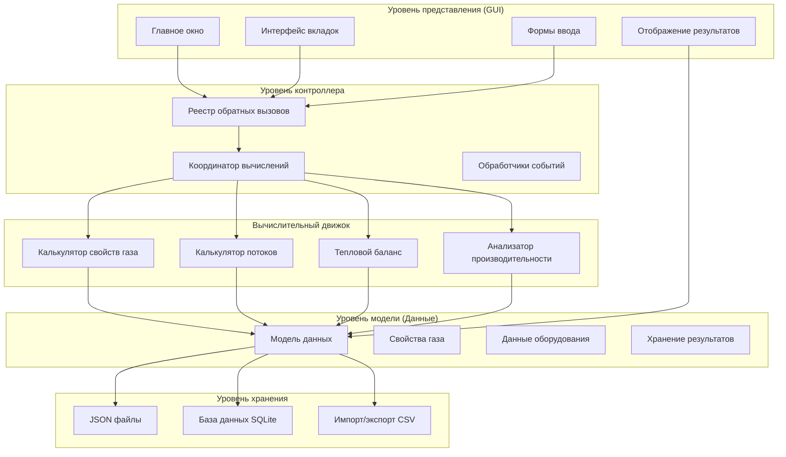

# Калькулятор Максимальной Пропускной Способности ГРС 🏭

[](https://python.org)
[](LICENSE)
[]()

> Комплексное настольное приложение для расчета максимальной пропускной способности газорегуляторных станций (ГРС) с использованием передовых термодинамических моделей и динамики потоков.

## 📋 Содержание
- [Обзор](#-обзор)
- [Основные возможности](#-основные-возможности)
- [Архитектура системы](#-архитектура-системы)
- [Установка](#-установка)
- [Быстрый старт](#-быстрый-старт)
- [Структура проекта](#-структура-проекта)
- [Руководство пользователя](#-руководство-пользователя)
- [Технические детали](#-технические-детали)
- [Участие в разработке](#-участие-в-разработке)
- [Лицензия](#-лицензия)

## 🎯 Обзор

**Калькулятор максимальной пропускной способности ГРС** - это специализированное инженерное приложение, предназначенное для определения оптимальной пропускной способности газорегуляторных станций. Система интегрирует сложные термодинамические расчеты, динамику потоков и анализ производительности оборудования для обеспечения точной оценки пропускной способности в различных рабочих условиях.

### Что делает программа:
- 🔬 **Анализ свойств газа**: Вычисляет плотность, коэффициенты сжимаемости и тепловые свойства
- 🏭 **Производительность оборудования**: Оценивает регуляторы, трубы и тепловые системы
- 📊 **Оптимизация пропускной способности**: Определяет максимальную пропускную способность станции
- 💾 **Управление данными**: Обрабатывает составы газа, диапазоны давлений и параметры оборудования
- 📈 **Визуализация результатов**: Предоставляет комплексные отчеты по расчетам

## ✨ Основные возможности

### 🧪 Продвинутый вычислительный движок
- **Свойства газовых смесей**: Уравнения состояния реального газа с расчетом Z-фактора
- **Динамика потоков**: Уравнения неразрывности для труб и расчеты регуляторов на основе Kv
- **Тепловой анализ**: Расчеты теплового баланса для систем контроля температуры
- **Интеграция производительности**: Комплексный анализ пропускной способности с учетом всех ограничений

### 🖥️ Удобный пользовательский интерфейс
- **Вкладочный рабочий процесс**: Интуитивный пошаговый процесс расчета
- **Формы ввода данных**: Структурированный ввод состава газа и параметров оборудования
- **Результаты в реальном времени**: Мгновенные обновления расчетов и валидация
- **Возможности экспорта**: Сохранение и загрузка сценариев расчетов

### 🔧 Технические возможности
- **Множественные форматы данных**: Поддержка JSON, CSV и базы данных SQLite
- **Система кэширования**: Оптимизированная производительность для повторных расчетов
- **Обработка ошибок**: Комплексная система валидации и логирования
- **Расширяемая архитектура**: Модульный дизайн для легкого добавления функций

## 🏗️ Архитектура системы

Приложение следует архитектурному паттерну **Модель-Представление-Контроллер (MVC)** с четким разделением обязанностей:



### Основные компоненты:

| Компонент | Файл | Назначение |
|-----------|------|------------|
| **Основное приложение** | `Main.py` | Управление GUI и контроллер приложения |
| **Модель данных** | `DataModel.py` | Хранение, валидация и постоянство данных |
| **Вычислительный движок** | `Calculate_file.py` | Основные математические функции и алгоритмы |
| **Калькулятор производительности** | `calculate_Max_performance.py` | Координатор расчета максимальной пропускной способности |
| **Управление таблицами** | `Work_table.py` | Обработчики таблиц оборудования и параметров |
| **UI компоненты** | `Tab_calculate.py` | Реализация отдельных вкладок расчетов |
| **Конфигурация** | `logger_config.py` | Настройка логирования и обработки ошибок |

## 🚀 Установка

### Требования
- Python 3.8 или выше
- tkinter (обычно входит в состав Python)
- Необходимые Python пакеты (см. зависимости)

### Зависимости
```bash
pip install pandas numpy matplotlib
```

### Быстрая установка
1. **Клонирование репозитория**:
   ```bash
   git clone <repository-url>
   cd Calculation-of-the-maximum-capacity-of-a-gas-station
   ```

2. **Установка зависимостей**:
   ```bash
   pip install -r requirements.txt  # если доступен
   # или вручную:
   pip install pandas numpy matplotlib
   ```

3. **Запуск приложения**:
   ```bash
   python Main.py
   ```

## 🎮 Быстрый старт

### Основной рабочий процесс:

1. **Запуск приложения**
   ```bash
   python Main.py
   ```

2. **Настройка исходных данных**
   - Перейдите на вкладку "Исходные данные"
   - Нажмите "Ввести состав газа" для задания состава газа
   - Настройте диапазоны температур и давлений
   - Настройте параметры оборудования в таблицах

3. **Выполнение расчетов**
   - Используйте "Автоматический расчет" для полного анализа
   - Или перейдите по отдельным вкладкам расчетов:
     - **Свойства газа**: Просмотр рассчитанных характеристик газа
     - **Пропускная способность трубы**: Анализ пропускной способности трубопровода
     - **Расчет регулятора**: Оценка производительности регулятора
     - **Тепловой баланс**: Просмотр требований к теплообмену

4. **Просмотр результатов**
   - Проверьте результаты расчетов в каждой вкладке
   - Экспортируйте результаты через меню "Файл"
   - Сохраните конфигурацию проекта для будущего использования

## 📁 Структура проекта

```
Calculation-of-the-maximum-capacity-of-a-gas-station/
├── 📄 Main.py                      # Главная точка входа в приложение
├── 📄 DataModel.py                 # Управление и хранение данных
├── 📄 Calculate_file.py            # Основные функции расчетов
├── 📄 calculate_Max_performance.py # Координатор расчетов производительности
├── 📄 Tab_calculate.py            # UI компоненты расчетов
├── 📄 Work_table.py               # Система управления таблицами
├── 📄 logger_config.py            # Конфигурация логирования
├── 📊 data.json                   # Примерные данные расчетов
├── 📖 README.md                   # Этот файл
└── 📁 logs/                       # Логи приложения (создается во время выполнения)
```

## 📚 Руководство пользователя

### Настройка состава газа
- Определите молярные доли компонентов газа (CH₄, C₂H₆, C₃H₈ и т.д.)
- Убедитесь, что общий состав равен 100%
- Система валидирует ввод и рассчитывает молекулярные свойства

### Конфигурация оборудования
- **Трубы**: Укажите диаметр, толщину стенки и свойства материала
- **Регуляторы**: Определите значения Kv и рабочие характеристики
- **Температурные системы**: Настройте требования к нагреву/охлаждению

### Типы расчетов

| Расчет | Назначение | Ключевые параметры |
|--------|------------|--------------------|
| **Свойства газа** | Термодинамические характеристики | P, T, состав |
| **Пропускная способность трубы** | Максимальный поток через трубопроводы | Диаметр, падение давления, скорость |
| **Производительность регулятора** | Анализ управления потоком | Значения Kv, соотношения давлений |
| **Тепловой баланс** | Требования к теплообмену | Изменения температуры, скорости потока |

## 🔬 Технические детали

### Методы расчета
- **Уравнения реального газа**: Расчеты Z-фактора для неидеального поведения газа
- **Уравнения потока**: Основанные на принципах непрерывности и характеристиках оборудования
- **Тепловые модели**: Уравнения энергетического баланса для контроля температуры
- **Алгоритмы оптимизации**: Определение максимальной пропускной способности при ограничениях

### Управление данными
- **Постоянство**: База данных SQLite с резервным копированием JSON
- **Валидация**: Проверка входных параметров и валидация диапазонов
- **Кэширование**: Оптимизация производительности для повторных расчетов
- **Экспорт/импорт**: Поддержка множественных форматов (JSON, CSV)

### Функции производительности
- **Пакетная обработка**: Расчеты множественных сценариев
- **Кэширование результатов**: Избежание избыточных вычислений
- **Управление памятью**: Эффективное использование структур данных
- **Восстановление после ошибок**: Грациозная обработка сбоев расчетов

## 🤝 Участие в разработке

Мы приветствуем участие в улучшении Калькулятора пропускной способности ГРС!

### Как участвовать:
1. Сделайте форк репозитория
2. Создайте ветку функции: `git checkout -b feature/amazing-feature`
3. Зафиксируйте изменения: `git commit -m 'Добавить потрясающую функцию'`
4. Отправьте в ветку: `git push origin feature/amazing-feature`
5. Откройте Pull Request

### Настройка разработки:
```bash
# Клонирование вашего форка
git clone <your-fork-url>
cd Calculation-of-the-maximum-capacity-of-a-gas-station

# Установка зависимостей для разработки
pip install -r requirements-dev.txt  # если доступен

# Запуск тестов
python -m pytest  # если тесты доступны
```

## 📄 Лицензия

Этот проект лицензирован под лицензией MIT - см. файл [LICENSE](LICENSE) для получения подробной информации.

---

**Создано с ❤️ для профессионалов газовой отрасли**

*Для технической поддержки или вопросов, пожалуйста, откройте issue в репозитории.*